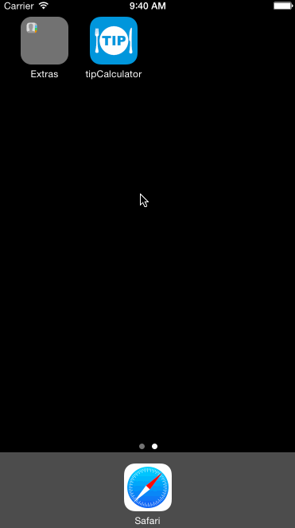

###KeHuang CodePath iOS Bootcamp tipCalculator demo

This is a "hello world" demo of CodePath iOS Bootcamp.

Time spent: 4 hours in total

Completed user stories:

 * [x] Required: Basic tip calculate feature, user can input bill amount and select tip rate, then calculate the tip and total amount.
 * [x] Required: Setting page with capability of setting default tip percentage.
 * [x] Optional: UI Improvement. User can split order for mutiple people.
 
 Notes: UI also works in iPhone6 Plus and iPad
 
 Walkthrough of all user stories:
 
 
 
 GIF created with [LiceCap](http://www.cockos.com/licecap/).